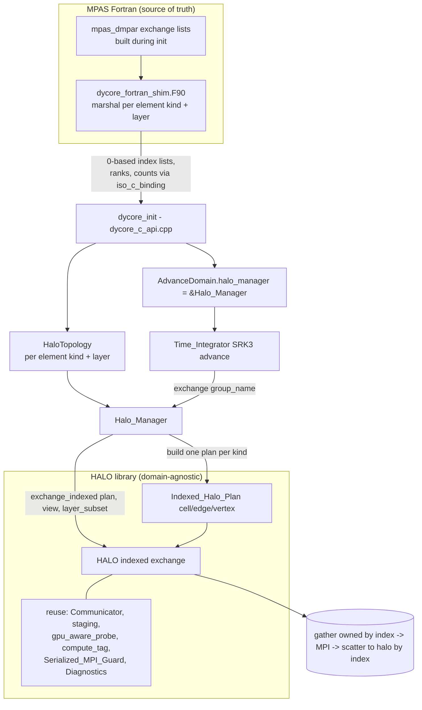
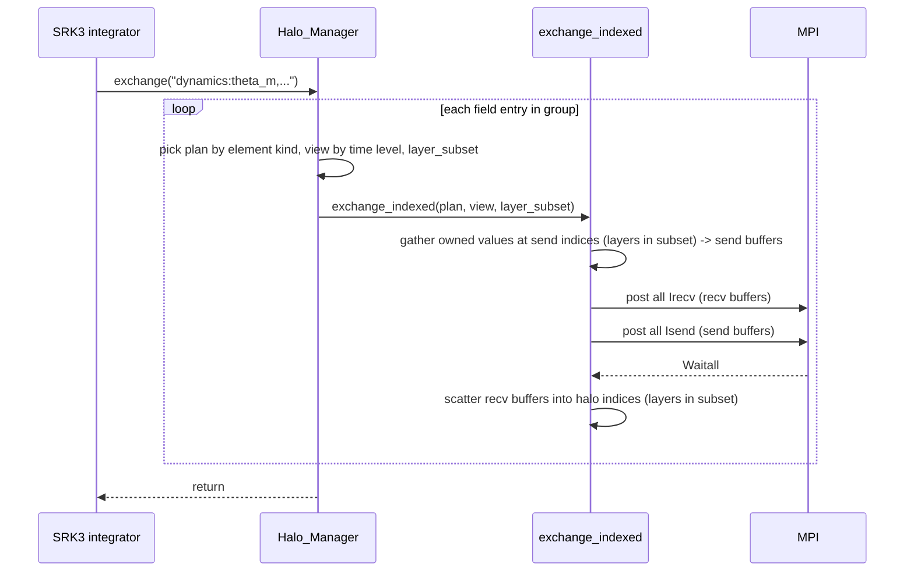

# Design Document: cpp-dycore-halo-exchange

## Overview

This design adds a general indexed (gather/scatter) halo-exchange capability to
the HALO library and wires the existing MPAS partition decomposition into the
C++/Kokkos dycore so that ghost (halo) cells are correctly communicated during
SRK3 time integration. It closes the structural gap that currently leaves
`AdvanceDomain.halo_manager == nullptr` and makes every halo-exchange call site
in `time_integrator_advance.hpp` a no-op.

The work has four layers, matching the requirements:

1. **HALO indexed exchange (Requirements 1-6, 12):** a new
   `Indexed_Halo_Plan` type and an `exchange_indexed` blocking API that gather
   owned elements by local index, communicate via MPI, and scatter received
   values into halo elements by local index. It is domain-agnostic, reuses the
   existing staging / GPU-aware / diagnostics / thread-safety facilities,
   supports host and device Kokkos views and rank-1 and rank-2 (LayoutLeft,
   nVertLevels x nElements) fields, and supports exchanging a subset of halo
   layers.
2. **MPAS marshalling (Requirements 7-8):** extract the already-built MPAS
   `mpas_exchange_list` / `mpas_multihalo_exchange_list` structures per element
   kind and halo layer, convert 1-based indices to 0-based, and pass them across
   the `dycore_init` C API without touching MPAS pool memory or the `atm_srk3`
   interface.
3. **Halo_Manager integration (Requirement 9):** build one `Indexed_Halo_Plan`
   per element kind from the marshalled topology and make `exchange(group_name)`
   honor each field's element kind, time level, and halo-layer subset from the
   existing `halo_group_registry`.
4. **Production wiring (Requirements 10-11):** construct the `Halo_Manager` in
   `dycore_init`, attach it to the `AdvanceDomain`, and confirm parity on the
   48-rank JW test.

### Design principles

- **Fortran is the source of truth.** The C++ exchange must mimic Fortran: same
  fields, same time levels, same halo-layer subsets, same call sites. The
  existing `halo_group_registry.hpp` already mirrors `mpas_atm_halos.F`; this
  design reuses it verbatim.
- **Generalize in HALO, specialize in the dycore.** The indexed capability is a
  domain-agnostic HALO feature (ranks + index lists only). MPAS-specific
  knowledge (which fields are on which element kind, index extraction) lives in
  the dycore/marshalling layer.
- **Reuse, do not duplicate.** The new exchange reuses `Communicator`,
  `Environment`, `detail::compute_tag`, `detail::Serialized_MPI_Guard`,
  `detail::staging`, `detail::gpu_aware_probe`, and `Diagnostics`.

## Research and findings

Key facts established by reading the codebase (treated as ground truth):

- **Existing contiguous API is a poor fit.** `halo::Halo_Plan`
  (`halo_plan.hpp`) stores only `{rank, count}` per neighbor, and
  `exchange_blocking` (`exchange.hpp`) assumes a single flat buffer laid out as
  `[send | owned | recv]`: it reads sends from `view.data() + 0` and writes
  receives to `view.data() + total_send_elements()`. MPAS fields are instead
  `[owned | halo]` with per-neighbor **index lists**, so the values to send are
  scattered among owned cells and the values to receive land in scattered halo
  cells. The existing API cannot express this; hence an indexed plan/exchange.
- **Infrastructure to reuse already exists.** `detail/pack_unpack.hpp` provides
  device-capable pack/unpack kernels; `detail/staging.hpp` provides host
  staging; `detail/gpu_aware_probe.hpp` + `Environment::is_gpu_aware_mpi()`
  provide runtime GPU-aware detection; `detail/compute_tag.hpp` provides the
  deterministic tag scheme; `Serialized_MPI_Guard` provides thread safety;
  `Diagnostics` provides begin/end events. The indexed path mirrors the control
  flow of `exchange_blocking` (post all recv, then all send, then wait).
- **MPAS exchange lists already exist post-init.** `mpas_dmpar_types.inc`
  defines `mpas_exchange_list { endPointID, nlist, srcList(:), destList(:),
  next }` and `mpas_multihalo_exchange_list { halos(:) % exchList }` indexed by
  halo layer. A field's `sendList`/`recvList` are these multihalo structures.
  These are built during MPAS init and must be read, not rebuilt.
- **Dycore scaffolding is in place.** `halo_manager.hpp` defines `Halo_Manager`,
  `HaloTopology`, `HaloNeighborInfo` (currently only `{rank, count}`, ignores
  layers, never constructed in production) and already implements a
  registry-driven `exchange(group_name)`; but it builds contiguous `Halo_Plan`s
  and uses a hard-coded name-based edge/cell split. `halo_group_registry.hpp`
  already encodes the exact field/time-level/layer sets from `mpas_atm_halos.F`.
  The SRK3 integrator already calls `domain.halo_manager->exchange("...")` at all
  the correct points, guarded by `if (domain.halo_manager)`.
- **The null wiring is the bug.** `dycore_c_api.cpp` builds `AdvanceDomain{...
  .halo_manager = nullptr ...}` (line ~557). No topology is ever marshalled.

Conclusion: the minimal-risk, general solution is (a) add an indexed plan +
exchange to HALO, (b) extend `HaloNeighborInfo`/`HaloTopology` to carry
per-layer index lists, (c) marshal MPAS lists across `dycore_init`, and (d)
replace the null `halo_manager` with a constructed one.

## Architecture



### Control flow of a single indexed exchange



### Element-kind to plan mapping

The current `Halo_Manager::exchange` chooses edge vs cell by a hard-coded field
name list. This design replaces that with an explicit element-kind lookup so
that vertex fields and any future field are handled correctly. The mapping from
field name to element kind is a small static table in the dycore (cell-based,
edge-based, vertex-based), consistent with the MPAS field definitions.

## Components and Interfaces

### 1. HALO: `Indexed_Halo_Plan` (new, `halo/indexed_halo_plan.hpp`)

Stores per-neighbor, per-layer index lists for one element kind. Domain-agnostic
(Requirement 6.1).

```cpp
namespace halo {

enum class Element_Kind { cell, edge, vertex, generic };

// One neighbor's index lists, organized by halo layer (layer index is 0-based;
// layer L holds the indices belonging to MPAS halo layer L+1).
struct Indexed_Neighbor {
    int rank;                                     // neighbor MPI rank
    std::vector<std::vector<std::size_t>> layers; // layers[l] = local indices for layer l
    // Convenience: total indices across all layers.
    [[nodiscard]] std::size_t total_indices() const noexcept;
    // Indices for a given subset of layers, concatenated in layer order.
    [[nodiscard]] std::vector<std::size_t> indices_for(std::span<const int> layer_subset) const;
};

class Indexed_Halo_Plan {
  public:
    Indexed_Halo_Plan(const Communicator& comm,
                      Element_Kind kind,
                      std::vector<Indexed_Neighbor> send_neighbors,
                      std::vector<Indexed_Neighbor> recv_neighbors);

    // Copy/move enabled.

    [[nodiscard]] Element_Kind element_kind() const noexcept;      // Req 1.5
    [[nodiscard]] std::span<const Indexed_Neighbor> send_info() const noexcept;
    [[nodiscard]] std::span<const Indexed_Neighbor> recv_info() const noexcept;
    [[nodiscard]] std::size_t num_send_neighbors() const noexcept;
    [[nodiscard]] std::size_t num_recv_neighbors() const noexcept;
    [[nodiscard]] std::size_t total_send_indices() const noexcept; // Req 1.3
    [[nodiscard]] std::size_t total_recv_indices() const noexcept; // Req 1.3
    [[nodiscard]] std::size_t num_layers() const noexcept;
    [[nodiscard]] const Communicator& communicator() const noexcept;

  private:
    // Validates ranks in [0, comm.size()) and rejects duplicates (Req 1.2).
};

}  // namespace halo
```

Design notes:
- Validation mirrors `Halo_Plan`: reject rank `< 0` or `>= comm.size()` and
  duplicate ranks within a list (Requirement 1.2). Empty index lists are valid
  (Requirement 1.4).
- `Element_Kind` is stored so the Halo_Manager can match a field to its plan
  (Requirement 1.5). `generic` lets non-MPAS clients ignore the concept.

### 2. HALO: `exchange_indexed` (new, `halo/exchange_indexed.hpp`)

Blocking gather/scatter exchange. Mirrors the structure and dispatch of
`exchange_blocking` but drives per-neighbor **index gathers/scatters** into
dense per-neighbor buffers instead of contiguous offset slices.

```cpp
namespace halo {

// Blocking indexed halo exchange over a subset of halo layers.
// layer_subset entries are 0-based layer indices; passing all layers exchanges
// the full halo. field_view is rank-1 (nElements) or rank-2
// (nVertLevels x nElements, LayoutLeft).
template <typename ViewType>
void exchange_indexed(const Indexed_Halo_Plan& plan,
                      ViewType& field_view,
                      std::span<const int> layer_subset);

}  // namespace halo
```

Algorithm (per Requirements 2, 3, 4, 5, 12):

1. **Early out:** if the plan has no send and no recv neighbors, return
   unchanged (Requirement 2.4, 6.3).
2. **Per-element block size** `bs`: rank-1 -> 1; rank-2 -> `extent(0)`
   (nVertLevels), because LayoutLeft stores each element's column contiguously
   along dimension 0 (Requirement 3.1, 3.2).
3. **Gather:** for each send neighbor, compute the concatenated index list for
   `layer_subset`, allocate a dense buffer of `n_idx * bs`, and launch a Kokkos
   gather kernel in the view's execution space (Requirement 4.1): for rank-1
   `buf(k) = view(idx(k))`; for rank-2 `buf(k*bs + lev) = view(lev, idx(k))`.
4. **Communicate:** acquire `Serialized_MPI_Guard` (Requirement 4.2); compute
   tags with `detail::compute_tag` (Requirement 2.6); post all `MPI_Irecv` into
   per-neighbor recv buffers, then all `MPI_Isend` from send buffers, then
   `MPI_Waitall` (Requirement 2.2). Dispatch host-staged vs GPU-aware using the
   same `requires_staging_v` + `Environment::is_gpu_aware_mpi()` logic
   (Requirements 3.3-3.5, 4.4). Buffers are device views on the GPU-aware path
   and host mirrors on the staged path (reusing `detail::staging`).
5. **Scatter:** for each recv neighbor, launch a Kokkos scatter kernel writing
   `view(idx(k))` (rank-1) or `view(lev, idx(k))` (rank-2) from the recv buffer
   (Requirement 2.3). Layers not in `layer_subset` are never written, so their
   halo elements are unchanged (Requirement 5.3).
6. **Diagnostics:** if active, emit begin/end events with neighbor count and
   byte volume (Requirement 4.3).
7. **Errors:** any nonzero MPI return raises an error naming the operation and
   neighbor rank via the existing `detail::handle_mpi_error` (Requirement 2.5).

Determinism: receives are scattered by index into disjoint halo slots, so the
final view is independent of neighbor ordering (Requirement 12.1). With owned
values fixed, repeating the exchange writes identical halo values
(Requirement 12.2).

An async variant (`exchange_indexed_async`) is out of scope for this feature
(blocking is sufficient for parity); the API is shaped so it can be added later
without breaking callers.

### 3. Dycore: extended `HaloTopology` / `HaloNeighborInfo`

`HaloNeighborInfo` gains per-layer index lists; `HaloTopology` gains vertex
lists. These carry the marshalled MPAS data into plan construction.

```cpp
struct HaloNeighborInfo {
    int rank = 0;
    // layers[l] = 0-based local indices for halo layer l (send: owned indices to
    // gather; recv: halo indices to fill).
    std::vector<std::vector<std::size_t>> layers;
};

struct HaloTopology {
    std::vector<HaloNeighborInfo> cell_send_neighbors,   cell_recv_neighbors;
    std::vector<HaloNeighborInfo> edge_send_neighbors,   edge_recv_neighbors;
    std::vector<HaloNeighborInfo> vertex_send_neighbors, vertex_recv_neighbors;
};
```

### 4. Dycore: `Halo_Manager` (extended)

- Build three `Indexed_Halo_Plan`s (cell, edge, vertex) from the topology
  (Requirement 9.1), each `nullptr` when its lists are empty (single-rank).
- Add a static field-name -> `Element_Kind` table replacing the hard-coded edge
  name list (Requirement 9.2).
- `exchange(group_name)`: for each field entry, resolve element kind -> plan,
  time level -> view, and pass the entry's `halo_layers` (converted to 0-based
  layer indices) as the `layer_subset` to `exchange_indexed` (Requirements 9.3,
  9.4). Unknown group -> error (Requirement 9.5); missing field -> skip
  (Requirement 9.6).

```cpp
class Halo_Manager {
  // ...
  void exchange(const std::string& group_name);  // now indexed + layer-aware
 private:
  std::unique_ptr<halo::Indexed_Halo_Plan> cell_plan_, edge_plan_, vertex_plan_;
  static halo::Element_Kind element_kind_of(std::string_view field_name);
};
```

### 5. Marshalling: `dycore_fortran_shim.F90` + `dycore_c_api`

- Fortran side: for each element kind, walk the field's
  `mpas_multihalo_exchange_list % halos(:) % exchList` linked lists, collecting
  per-neighbor `(endPointID, per-layer srcList/destList)`; flatten into arrays
  passed via iso_c_binding (Requirements 7.1, 7.2). Indices converted 1-based ->
  0-based at the boundary (Requirement 7.3). Reads existing lists only; does not
  rebuild decomposition (Requirement 7.4) and does not alter pool memory or the
  `atm_srk3` interface (Requirement 8).
- C side: `dycore_init` gains parameters carrying the flattened per-element-kind,
  per-layer send/recv ranks, counts, and index arrays (Requirement 7.5), and
  reconstructs `HaloTopology`.

Marshalling uses a CSR-style flattening to keep the C signature simple: for each
element kind and direction, pass `n_neighbors`, `neighbor_ranks[]`,
`layer_counts[n_neighbors * n_layers]`, and a single concatenated `indices[]`
array whose slices are delimited by the prefix sum of `layer_counts`.

### 6. Wiring: `dycore_c_api.cpp`

- Construct a `Halo_Manager` in `dycore_init` from the reconstructed
  `HaloTopology` and field store (Requirement 10.1); store it in the persistent
  dycore context.
- Set `AdvanceDomain.halo_manager = &context->halo_manager` (replacing
  `nullptr`) (Requirement 10.2). The existing guarded call sites then perform
  real exchanges (Requirement 10.3).

## Data Models

### MPAS source structures (read-only, from `mpas_dmpar_types.inc`)

- `mpas_exchange_list { endPointID: rank; nlist: count; srcList(:): 1-based owned
  indices to send; destList(:): 1-based halo indices to fill; next }`.
- `mpas_multihalo_exchange_list { halos(:) % exchList }` — `halos(l)` is the
  exchange list for halo layer `l`.
- A field's `sendList` and `recvList` are `mpas_multihalo_exchange_list`.

### C API marshalled arrays (per element kind, per direction)

| Field | Type | Meaning |
|-------|------|---------|
| `n_neighbors` | int | number of neighbor ranks in this direction |
| `n_layers` | int | number of halo layers |
| `neighbor_ranks` | int[n_neighbors] | neighbor MPI ranks |
| `layer_counts` | int[n_neighbors * n_layers] | index count per (neighbor, layer) |
| `indices` | int[sum(layer_counts)] | concatenated 0-based local indices |

### HALO plan model

- `Indexed_Neighbor { rank; layers: vector<vector<size_t>> }` — `layers[l]` is
  the 0-based local index list for layer `l`.
- `Indexed_Halo_Plan { element_kind; send_neighbors[]; recv_neighbors[] }`.

### Field views (from `field_store`)

- Rank-1: `View<double*>` indexed by element (size = owned + halo).
- Rank-2: `View<double**, LayoutLeft>` shape `(nVertLevels, nElements)`; each
  element's column is contiguous along dim 0.

### Registry model (existing, reused unchanged)

- `HaloFieldEntry { field_name; time_level; halo_layers }`,
  `HaloGroupDefinition { group_name; fields[] }`. The `halo_layers` values are
  MPAS 1-based layer numbers; the Halo_Manager converts them to 0-based layer
  indices when forming the `layer_subset`.

## Correctness Properties

*A property is a characteristic or behavior that should hold true across all
valid executions of a system-essentially, a formal statement about what the
system should do. Properties serve as the bridge between human-readable
specifications and machine-verifiable correctness guarantees.*

The properties below apply to the domain-agnostic HALO indexed-exchange layer
and the plan-construction logic, which are pure, input-driven transformations
suitable for property-based testing. The end-to-end parity, marshalling, and
wiring criteria (Requirements 7-8, 10-11, and the MPI-path/error/diagnostics
criteria) are validated by integration, smoke, and example tests described in
the Testing Strategy; they are not universally quantified value properties.

### Property 1: Plan preserves neighbor topology

*For any* set of send and receive neighbors, each with a rank and per-layer local
index lists, constructing an Indexed_Halo_Plan and reading back its send and
receive neighbor information yields the same ranks, the same per-layer index
lists, and the same element kind that were supplied.

**Validates: Requirements 1.1, 1.5, 5.1**

### Property 2: Plan totals equal the sum of index lists

*For any* Indexed_Halo_Plan, the reported total send index count equals the sum
of the lengths of all per-neighbor, per-layer send index lists, and the reported
total receive index count equals the sum of the lengths of all per-neighbor,
per-layer receive index lists.

**Validates: Requirements 1.3**

### Property 3: Indexed exchange round-trip fills halo with source-owned values

*For any* field view (rank-1 indexed by element, or rank-2 nVertLevels x
nElements in LayoutLeft), and *for any* paired send/receive index lists between a
sending and receiving side, after an indexed exchange each receive index holds
exactly the value(s) that resided at the paired send index on the sending side;
for rank-2 fields every vertical level is transferred.

**Validates: Requirements 2.1, 2.3, 3.1, 3.2, 3.5**

### Property 4: Empty or neighborless plan is a no-op

*For any* field view, invoking indexed exchange with a plan that has no send and
no receive neighbors leaves every element of the field view bitwise unchanged.

**Validates: Requirements 2.4, 6.3**

### Property 5: Layer-subset exactness

*For any* Indexed_Halo_Plan and *for any* subset of halo layers, an indexed
exchange over that subset writes exactly the receive indices belonging to the
selected layers and leaves every halo element that belongs only to excluded
layers unchanged.

**Validates: Requirements 5.2, 5.3**

### Property 6: One-based to zero-based index conversion

*For any* list of one-based local indices, the marshalling conversion produces a
list in which each converted index equals the original minus one, and every
converted index is non-negative.

**Validates: Requirements 7.3**

### Property 7: Halo_Manager builds plans faithfully from topology

*For any* HaloTopology, the plans the Halo_Manager builds for each element kind
contain exactly the neighbor ranks and per-layer index lists present in that
element kind's send and receive neighbor lists.

**Validates: Requirements 9.1**

### Property 8: Neighbor-order independence

*For any* field view and Indexed_Halo_Plan, performing the indexed exchange with
the plan's neighbors in any permutation of order produces identical field-view
values after completion.

**Validates: Requirements 12.1**

### Property 9: Idempotence for a fixed owned state

*For any* field view and Indexed_Halo_Plan, applying the indexed exchange twice
in succession without modifying owned elements between the two calls leaves the
halo elements at the same values after the second call as after the first.

**Validates: Requirements 12.2**

## Error Handling

- **Invalid neighbor rank (Req 1.2):** `Indexed_Halo_Plan` construction validates
  every rank against `[0, comm.size())` and rejects duplicate ranks within a
  single send or receive list, throwing `std::invalid_argument` naming the
  offending rank, matching the existing `Halo_Plan` contract.
- **MPI operation failure (Req 2.5):** every `MPI_Irecv`, `MPI_Isend`, and
  `MPI_Waitall` return code is checked; a failure is routed through the existing
  `detail::handle_mpi_error`, which raises an error naming the operation and the
  neighbor rank while respecting the active `ErrorPolicy`.
- **Unknown group (Req 9.5):** `Halo_Manager::exchange` throws
  `std::runtime_error` naming the group when it is absent from the registry.
- **Missing field (Req 9.6):** a group field that is not present in the field
  store is skipped silently so a group may be exchanged before all fields are
  populated; remaining fields are still exchanged.
- **Missing plan (single-rank / empty topology):** when an element kind's plan is
  `nullptr`, the corresponding exchange is skipped; `exchange_indexed` also
  early-returns for empty plans, so single-rank runs never touch MPI.
- **Index bounds:** marshalled indices are validated at construction in debug
  builds (each index `< nElements` for its element kind); out-of-range indices
  raise an error identifying the element kind, preventing the uninitialized
  ghost-slot reads that currently cause single-rank NaN.
- **MPI_Comm_dup failure:** unchanged from the current `Halo_Manager`, which
  throws if the communicator cannot be duplicated at construction.

## Testing Strategy

### Dual approach

Property-based tests verify the universal properties of the pure
indexed-exchange and plan-construction logic; unit, example, integration, and
smoke tests cover error paths, MPI path selection, marshalling against live MPAS
structures, wiring, and end-to-end parity.

### Property-based tests (HALO library, `helm-project/libs/halo/tests`)

- Library: use the HALO test suite's existing property/generator facilities (do
  not implement property-based testing from scratch). If a dedicated PBT
  dependency is not already present in the HALO test target, add a standard C++
  property-testing library (e.g. RapidCheck) to that target only.
- Each property test runs a minimum of 100 iterations.
- Each test is tagged with a comment of the form
  **Feature: cpp-dycore-halo-exchange, Property {number}: {property_text}**.
- Implement each of Properties 1-9 as a single property-based test:
  - Properties 1, 2, 4, 5, 6, 8, 9 run in a single process (self-communicator or
    a plan whose send indices map to the same process's recv indices), which lets
    the gather/scatter round-trip be validated deterministically without multiple
    ranks. Generators produce random neighbor counts, per-layer index lists
    (including empty lists), rank-1 and rank-2 fields, and random layer subsets.
  - Property 3 (round-trip) is validated both in-process via a paired
    send-index/recv-index model and, on a 2-rank communicator in the MPI test
    harness, by seeding owned values as a function of (rank, index) and checking
    each halo cell against the analytic source value.
  - Property 7 exercises the dycore `Halo_Manager` plan construction over
    generated `HaloTopology` inputs.
- Generators must include edge cases from the prework: empty index lists
  (Req 1.4), single-layer and multi-layer plans, and rank-2 fields with varying
  nVertLevels (Req 3.2).

### Unit / example tests

- Invalid-rank construction throwing (Req 1.2); empty-list validity (Req 1.4);
  element-kind accessor (Req 1.5).
- Diagnostics begin/end emission with correct neighbor count and byte volume when
  a diagnostics sink is active (Req 4.3).
- Tag equivalence with the contiguous exchange for matching rank pairs (Req 2.6).
- MPI failure error message via a forced/mocked failure where feasible (Req 2.5).
- `Halo_Manager`: element-kind mapping per representative field (Req 9.2); time
  level forwarded from registry (Req 9.3); layer subset forwarded 0-based
  (Req 9.4); unknown-group throw (Req 9.5); missing-field skip (Req 9.6).
- Marshalling helper: 1-based to 0-based conversion boundary cases (Req 7.3,
  also covered by Property 6).

### Integration tests

- Multi-rank (2-4 rank) exchange on a small synthetic partition verifying halo
  cells are filled and exchange completes (Req 2.2, 3.3-3.5, 4.1-4.4, 10.3).
- Marshalling on a small real MPAS partition: extracted per-element-kind,
  per-layer neighbor ranks and index counts match the MPAS `sendList`/`recvList`
  multihalo lists (Req 7.1, 7.2, 7.4).
- Device-view round-trip in a host-staged environment (Req 3.3, 4.1) and, when a
  GPU-aware MPI environment is available, the direct path (Req 3.4).

### Smoke tests

- `dycore_init` succeeds when passed the marshalled index arrays and produces a
  non-null `Halo_Manager` (Req 7.5, 10.1); `AdvanceDomain.halo_manager` is
  non-null when built for a timestep (Req 10.2).

### End-to-end parity (validation environment)

- Build incrementally:
  `bash -l /gpfs/f6/bil-fire3/scratch/Barry.Baker/models/MPAS-Model/testing/_kiro_build.sh`.
- Run the 48-rank JW validation: `cd testing && sbatch submit_validate_gaea.sh`.
- Compare against the Fortran reference:
  `compare_dycore_outputs.py <ref>/output.nc <cpp>/output.nc --tolerance 1e-13
  --fields u w theta_m rho_zz` (Req 11.1).
- Scan output fields for NaN/Inf in owned and halo cells (Req 11.2) and run the
  single-rank stability check (Req 11.3).

### Interface-stability checks

- Diff the `atm_srk3` interface to confirm no signature change (Req 8.2) and
  confirm the marshaller only reads MPAS pool pointers (Req 8.1, 7.4); the
  Fortran build passing is the regression gate.

### Notes on PBT scope

Property-based testing is applied only to the pure indexed-exchange and
plan-construction logic. Infrastructure and external-behavior criteria (MPI path
selection, thread-safety guard, GPU-aware probe, marshalling against live MPAS
state, and the AWS-free but high-cost 48-rank parity run) are covered by
integration and smoke tests with a small number of representative executions, per
the decision guide.
