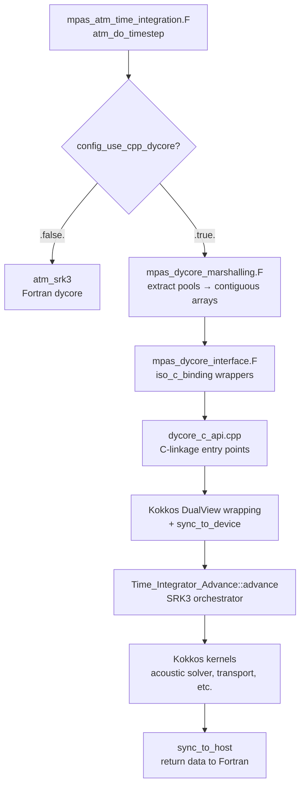
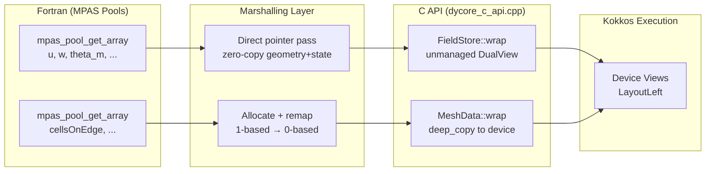
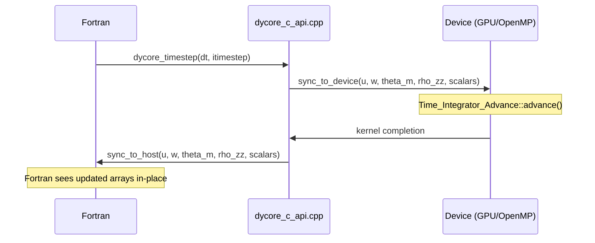

# Design Document

## Overview

This design describes the integration of the existing C++ MPAS nonhydrostatic dynamical core
(`libmpas_dycore_cpp.a`) into the production Fortran MPAS-Atmosphere executable. The C++ dycore
is a header-only Kokkos library with a thin compiled layer (`dycore_c_api.cpp`) that exposes three
C-linkage entry points: `dycore_init`, `dycore_timestep`, and `dycore_finalize`.

The integration introduces five components:

1. A Fortran `iso_c_binding` interface module (`mpas_dycore_interface`) already exists in the C++
   source tree. A new marshalling subroutine in the atmosphere core extracts fields from MPAS pools
   and invokes these bindings.
2. The C API implementation wraps Fortran-owned arrays as Kokkos unmanaged DualViews (LayoutLeft),
   manages the Kokkos lifecycle, and dispatches to `Time_Integrator_Advance::advance()`.
3. A runtime switch (`config_use_cpp_dycore`) in `mpas_atm_time_integration.F` gates between the
   existing Fortran `atm_srk3` and the C++ dycore at the per-timestep call site.
4. Build system modifications (Makefile variables + a CMake-based sub-build for the C++ library)
   produce `libmpas_dycore_cpp.a` and link it into the MPAS executable when
   `USE_CPP_DYCORE=true`.
5. A validation test script runs the Jablonowski-Williamson baroclinic wave test with both dycores
   and compares prognostic fields against a parity tolerance of 1.0e-13.

### Key Design Decisions

| Decision | Rationale |
|----------|-----------|
| LayoutLeft (column-major) for Kokkos Views | Matches Fortran storage order exactly, enabling zero-copy wrapping of all real-valued 2D/3D fields |
| One-time copy for connectivity arrays | Connectivity arrays need 1-based to 0-based conversion; a single allocation+transform at init time avoids per-timestep overhead |
| Static library linked by GNU Make | MPAS uses GNU Make as its top-level build system; CMake builds the `.a` internally, but the final link step is a Make recipe |
| Preprocessor guard `MPAS_CPP_DYCORE` | Allows the integration code to be present in source without affecting builds that lack Kokkos |
| Kokkos init/finalize scoped to `dycore_init`/`dycore_finalize` | Ensures exactly-once lifecycle management and clean teardown before program exit |

---

## Architecture

The Fortran→C→C++ call chain follows this layered architecture:



### Call Sequence (per timestep)

```
atm_do_timestep()
  ├─ [first call] call dycore_init(dims, connectivity, geometry, state, config)
  │     ├─ Kokkos::initialize()
  │     ├─ MeshData::wrap(dims, ptrs)        -- zero-copy geometry, copy+remap connectivity
  │     ├─ FieldStore::wrap(prognostic_state) -- unmanaged DualViews over Fortran memory
  │     └─ Config built from scalar params
  │
  ├─ call dycore_timestep(dt, itimestep)
  │     ├─ sync_to_device(all prognostic fields)
  │     ├─ populate AdvanceDomain
  │     ├─ Time_Integrator_Advance::advance(domain)
  │     └─ sync_to_host(all modified prognostic fields)
  │
  └─ [shutdown] call dycore_finalize()
        ├─ destroy DycoreContext (releases all Views)
        └─ Kokkos::finalize()
```

---

## Components and Interfaces

### 1. Fortran Interface Module (`mpas_dycore_interface`)

Already implemented in `src/core_atmosphere/dynamics/cpp/src/dycore_fortran_shim.F90`. Declares
three `bind(C)` interface blocks:

| Subroutine | Parameters | Purpose |
|------------|-----------|---------|
| `dycore_init` | 6 dimension scalars, 4 connectivity pointers, 7 geometry pointers, 10 state pointers (2 TL x 5 fields), 9 config scalars | One-time initialization |
| `dycore_timestep` | `dt` (c_double), `itimestep` (c_int) | Per-timestep advance |
| `dycore_finalize` | none | Shutdown |

All integer arguments use `integer(c_int), value`. All array arguments are assumed-size
`intent(in)` or `intent(inout)` pointers. Real scalars use `real(c_double), value`.

### 2. Marshalling Module (`mpas_dycore_marshalling`)

A new Fortran module that provides a single public subroutine:

```fortran
subroutine mpas_dycore_call_init(domain)
  ! Extracts from domain % blocklist % ...pool:
  !   mesh dims:   nCells, nEdges, nVertices, nVertLevels, maxEdges
  !   connectivity: cellsOnEdge, edgesOnCell, verticesOnEdge, nEdgesOnCell
  !   geometry:    dvEdge, dcEdge, areaCell, zgrid, zz, fzm, fzp
  !   state (TL1+TL2): u, w, theta_m, rho_zz, scalars
  !   config:      from domain % configs pool
  !
  ! Connectivity arrays undergo 1→0 index remapping into module-local
  ! allocatable buffers before the call.
  call dycore_init(...)
end subroutine
```

The module also provides `mpas_dycore_call_timestep(dt, itimestep)` and
`mpas_dycore_call_finalize()` as thin pass-throughs.

#### Index Remapping Strategy

Connectivity arrays (`cellsOnEdge`, `edgesOnCell`, `verticesOnEdge`) are Fortran 1-based. The
C++ kernels use 0-based indexing. Rather than polluting every kernel with `index - 1`:

1. At `dycore_init` time, allocate temporary contiguous buffers sized to the connectivity arrays.
2. Copy with `buffer(i) = original(i) - 1` for all elements.
3. Pass buffer pointers to `dycore_init`.
4. The C API's `MeshData::wrap` then wraps these 0-based pointers as the host mirror.
5. Buffers persist (module-level allocatables) until `dycore_finalize`.

Geometry and prognostic arrays are passed directly (zero-copy) since they require no index
transformation and Fortran column-major layout matches `Kokkos::LayoutLeft`.

### 3. C API Implementation (`dycore_c_api.cpp`)

Already partially implemented. The key lifecycle is:

**`dycore_init`:**
1. `Kokkos::initialize()` (guarded by `!Kokkos::is_initialized()`)
2. Build `Config` from scalar parameters via `ConfigBuilder`
3. Allocate `DycoreContext` (static `unique_ptr`)
4. `MeshData::wrap(dims, ptrs)` — creates DualViews for mesh; performs one-time
   `deep_copy` host→device for geometry
5. `FieldStore::wrap("u", {u_tl1, u_tl2}, nVertLevels, nEdges)` — creates unmanaged
   DualViews whose host side aliases the Fortran pointer directly
6. Repeat for w, theta_m, rho_zz, scalars

**`dycore_timestep(dt, itimestep)`:**
1. `sync_to_device` on all prognostic fields (marks device as modified-on-host, triggers
   `deep_copy` host→device)
2. Populate `AdvanceDomain` struct with dimensions, config, dt, itimestep
3. Call `Time_Integrator_Advance::advance(domain)`
4. `sync_to_host` on all prognostic fields (triggers `deep_copy` device→host)
5. Fortran sees updated values in its original memory — no copy-back needed

**`dycore_finalize`:**
1. `g_context.reset()` — destroys all Views while Kokkos is still active
2. `Kokkos::finalize()`

### 4. Runtime Switch

Implemented in `mpas_atm_time_integration.F` inside `atm_do_timestep`:

```fortran
#ifdef MPAS_CPP_DYCORE
  if (config_use_cpp_dycore) then
    if (.not. cpp_dycore_initialized) then
      call mpas_dycore_call_init(domain)
      cpp_dycore_initialized = .true.
    end if
    call mpas_dycore_call_timestep(dt, itimestep)
  else
#endif
    if (trim(config_time_integration) == 'SRK3') then
      call atm_srk3(domain, dt, itimestep, exchange_halo_group)
    else
      call mpas_log_write('Unknown time integration option', messageType=MPAS_LOG_ERR)
    end if
#ifdef MPAS_CPP_DYCORE
  end if
#endif
```

The guard `#ifdef MPAS_CPP_DYCORE` ensures zero impact when compiled without C++ dycore support.
The `config_use_cpp_dycore` namelist variable (logical, default `.false.`) is read from the
`nhyd_model` config section.

### 5. Build System

The build involves two phases:

#### Phase A: CMake sub-build (C++ library)

```
src/core_atmosphere/dynamics/cpp/
├── CMakeLists.txt          (existing, builds libmpas_dycore_cpp.a)
├── src/
│   ├── dycore_c_api.cpp    (C API implementation)
│   └── mpas_dycore.cpp     (library registration)
└── include/mpas_dycore/    (headers)
```

The CMake build produces `libmpas_dycore_cpp.a` which statically links Kokkos, KokkosKernels,
and the halo library. This `.a` is self-contained from the Makefile's perspective.

#### Phase B: MPAS Makefile integration

When `USE_CPP_DYCORE=true`:

1. A new Makefile include (`cpp_dycore.mk`) is sourced from `src/core_atmosphere/dynamics/`:
   ```makefile
   ifdef USE_CPP_DYCORE
     CPP_DYCORE_DIR = $(PWD)/src/core_atmosphere/dynamics/cpp
     CPP_DYCORE_LIB = $(CPP_DYCORE_DIR)/build/libmpas_dycore_cpp.a
     CPP_DYCORE_INC = -I$(CPP_DYCORE_DIR)/include

     # Build the C++ library via CMake if not already built
     $(CPP_DYCORE_LIB):
         cmake -S $(CPP_DYCORE_DIR) -B $(CPP_DYCORE_DIR)/build \
               -DCMAKE_BUILD_TYPE=Release \
               -DMPAS_BUILD_TESTING=OFF
         $(MAKE) -C $(CPP_DYCORE_DIR)/build

     override CPPFLAGS += -DMPAS_CPP_DYCORE
     override LIBS += $(CPP_DYCORE_LIB) -lstdc++ -lkokkoscore -lkokkoskernels
     override FCINCLUDES += $(CPP_DYCORE_INC)

     # The Fortran shim and marshalling module are added to the dynamics file list
     dynamics_OBJS += mpas_dycore_interface.o mpas_dycore_marshalling.o
   endif
   ```

2. The `MPAS_CPP_DYCORE` preprocessor macro enables conditional compilation in Fortran sources.

3. When `USE_CPP_DYCORE` is absent, no C++ compiler, Kokkos, or additional libraries are required.

---

## Data Models

### Field Ownership and Memory Layout

| Field Category | Owner | Kokkos View Type | Sync Pattern |
|---------------|-------|-----------------|--------------|
| Mesh geometry (dvEdge, areaCell, zgrid, ...) | Fortran pool | Unmanaged DualView, LayoutLeft | Host→Device once at init |
| Mesh connectivity (cellsOnEdge, ...) | Fortran pool (original) / Marshalling module (0-based copy) | Unmanaged DualView, LayoutLeft | Host→Device once at init |
| Prognostic state (u, w, theta_m, rho_zz, scalars) | Fortran pool | Unmanaged DualView, LayoutLeft | Host→Device at timestep entry; Device→Host at timestep exit |
| Diagnostic/scratch (tendencies, acoustic vars) | C++ dycore | Owned View (device) | No Fortran sync |

### DycoreContext Struct

```cpp
struct DycoreContext {
  MeshDims dims;
  int num_scalars;
  MeshDataT mesh;                     // wrapped connectivity + geometry
  FieldStore state_store;             // wrapped prognostic DualViews
  Config config;
  std::vector<std::string> prognostic_field_names;  // for batch sync
};
```

### Data Flow: Field Marshalling



### Sync Protocol (per timestep)



---

## Error Handling

### Build-time vs Runtime Mismatch

If `config_use_cpp_dycore = .true.` in the namelist but the executable was built without
`USE_CPP_DYCORE=true` (and thus `MPAS_CPP_DYCORE` is not defined):

```fortran
#ifndef MPAS_CPP_DYCORE
  if (config_use_cpp_dycore) then
    call mpas_log_write( &
      'config_use_cpp_dycore is .true. but executable was built without USE_CPP_DYCORE=true', &
      messageType=MPAS_LOG_CRIT)
    ! MPAS_LOG_CRIT triggers abort
  end if
#endif
```

### C API Error Codes

The current C API uses `void` return types. For robust error handling, `dycore_init` should be
extended to return an `int` error code:

| Code | Meaning |
|------|---------|
| 0 | Success |
| 1 | Kokkos initialization failed |
| 2 | Invalid dimensions (nVertLevels <= 0, nCells <= 0, etc.) |
| 3 | Null pointer for a required array |

The Fortran marshalling module checks the return code and calls `mpas_log_write(..., MPAS_LOG_CRIT)`
on any non-zero value, triggering a graceful MPI abort.

### Dimension Validation

Inside `dycore_init`, before any wrapping:

```cpp
if (nCells <= 0 || nEdges <= 0 || nVertLevels <= 0 || maxEdges <= 0) {
  return 2;  // Invalid dimensions
}
```

### Kokkos Lifecycle Guards

- `dycore_init` checks `Kokkos::is_initialized()` before calling `Kokkos::initialize()`
- `dycore_finalize` checks `Kokkos::is_initialized()` before calling `Kokkos::finalize()`
- `dycore_timestep` returns immediately (no-op) if `g_context == nullptr`

---

## Correctness Properties

*A property is a characteristic or behavior that should hold true across all valid executions of a system — essentially, a formal statement about what the system should do. Properties serve as the bridge between human-readable specifications and machine-verifiable correctness guarantees.*

### Property 1: FFI Value Passthrough

*For any* set of valid dimension scalars (nCells, nEdges, nVertices, nVertLevels, maxEdges, num_scalars) and configuration parameters (time_integration_order, number_of_sub_steps, etc.) passed from Fortran through `iso_c_binding` to the C API, the values received on the C side SHALL be identical to the values sent from the Fortran side.

**Validates: Requirements 1.2, 1.6**

### Property 2: Index Remapping Correctness

*For any* integer array of Fortran 1-based connectivity indices, after the marshalling layer applies the 0-based remapping, every element in the output buffer SHALL equal the corresponding input element minus one.

**Validates: Requirements 2.3, 2.4**

### Property 3: Zero-Copy Pointer Identity

*For any* contiguous Fortran array of real(c_double) values (geometry or prognostic fields), the pointer value received by the C API SHALL be identical to `c_loc()` of the original Fortran array — confirming no intermediate copy was made.

**Validates: Requirements 2.2**

### Property 4: LayoutLeft View Indexing Equivalence

*For any* 2D Fortran array declared as `field(nVertLevels, nCells)` and wrapped as an unmanaged `Kokkos::View<double**, LayoutLeft>`, accessing `view(k, i)` SHALL return the same value as `field(k+1, i+1)` in 1-based Fortran indexing (i.e., the element at linear offset `k + i * nVertLevels`).

**Validates: Requirements 3.2**

### Property 5: Host-Device Sync Round-Trip

*For any* prognostic field array modified on the host side, after `sync_to_device` followed by `sync_to_host` with no intervening device modification, every element SHALL be unchanged (round-trip identity). Conversely, *for any* modification made on the device side during a timestep, after `sync_to_host`, the host-side (Fortran-owned) array SHALL reflect the device modification.

**Validates: Requirements 3.4, 3.6**

### Property 6: L-Infinity Relative Norm Computation

*For any* two floating-point arrays A and B of the same dimensions where `max|A| > 0`, the comparison function SHALL compute `max|A(i) - B(i)| / max|A(i)|` correctly (i.e., the computed result equals the mathematically expected L-infinity relative norm to within floating-point precision).

**Validates: Requirements 6.4**

### Property 7: Parity Threshold Decision

*For any* set of per-field L-infinity relative differences, the validation tool SHALL report PASS if and only if all differences are strictly less than 1.0e-13, and SHALL report FAIL (with the offending field name, timestep, and actual difference) if any difference is greater than or equal to 1.0e-13.

**Validates: Requirements 6.5, 6.6**

### Property 8: Dimension Validation Rejects Invalid Inputs

*For any* dimension tuple passed to `dycore_init` where at least one of (nCells, nEdges, nVertLevels, maxEdges) is less than or equal to zero, the C API SHALL return a non-zero error code without initializing Kokkos or wrapping any Views.

**Validates: Requirements 8.3**

---

## Testing Strategy

### Unit Testing

The C++ dycore already has 300+ unit tests in `src/core_atmosphere/dynamics/cpp/tests/` covering
individual kernels and modules. These continue to run via CTest.

For the integration layer specifically:

- **Marshalling tests**: Verify that index remapping produces 0-based values for a small
  synthetic mesh.
- **C API lifecycle tests**: Verify init/timestep/finalize sequence doesn't crash or leak.
- **Config round-trip**: Verify all 9 config parameters arrive correctly through the C API.

### Integration Testing (JW Baroclinic Wave)

The primary validation is the Jablonowski-Williamson test:

1. Build MPAS with `USE_CPP_DYCORE=true CORE=atmosphere`
2. Run 120 timesteps (1 simulated day) at 240km/55 levels with Fortran dycore → `reference.nc`
3. Run same configuration with `config_use_cpp_dycore = .true.` → `cpp_run.nc`
4. For each prognostic field at each output interval, compute:
   ```
   L_inf_relative = max|cpp - ref| / max|ref|
   ```
5. PASS if all values < 1.0e-13; FAIL with field name, timestep, and actual diff otherwise

### Validation Script

A shell script (`testing/validate_cpp_dycore.sh`) automates:
- Building both executables (or one with the runtime switch)
- Running the reference case
- Running the C++ case
- Invoking an NCO/Python comparison tool
- Reporting PASS/FAIL + wall-clock timing per timestep

### Property-Based Testing

The correctness properties above are suitable for property-based testing because:
- They operate on pure transformations (index remapping, norm computation, threshold logic)
- The input spaces are large (arbitrary array sizes, arbitrary values)
- Universal quantification ("for all arrays...") maps directly to PBT generators

**Library**: GoogleTest with a custom generator framework (the C++ dycore already uses
GoogleTest). For Fortran-side properties (1, 3), a small C++ test harness calls through the
`extern "C"` boundary using GoogleTest.

**Configuration**:
- Minimum 100 iterations per property test
- Each test tagged with: `// Feature: fortran-integration, Property N: <property_text>`

**Property Test Mapping**:

| Property | Test Approach | Generator |
|----------|--------------|-----------|
| 1: FFI Value Passthrough | Call `dycore_init` with random valid dims, verify via instrumented C API | Random ints in [1, 10000] for dims |
| 2: Index Remapping | Apply remap function to random int arrays, verify element-wise | Random int arrays, values in [1, 100000] |
| 3: Zero-Copy Pointer Identity | Allocate Fortran-style array, pass to C, compare addresses | Random sizes [1, 1000] |
| 4: LayoutLeft Indexing | Wrap random 2D array, verify random (k,i) access | Random 2D arrays with dims in [1, 100] |
| 5: Sync Round-Trip | Modify host array, sync→device→host, verify identity | Random double arrays |
| 6: L-inf Norm | Compute on random array pairs, verify against naive implementation | Random double arrays with known differences |
| 7: Threshold Decision | Generate random difference sets, verify PASS/FAIL correctness | Random doubles around 1e-13 boundary |
| 8: Dimension Validation | Generate invalid dimension tuples, verify error code | Random tuples with at least one <= 0 |

### Build Regression

CI should verify:
- `make gnu CORE=atmosphere` (without `USE_CPP_DYCORE`) compiles cleanly
- `make gnu CORE=atmosphere USE_CPP_DYCORE=true` compiles and links cleanly
- The C++ library's own CTest suite passes

