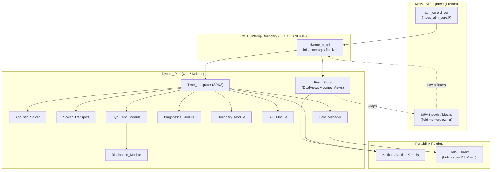
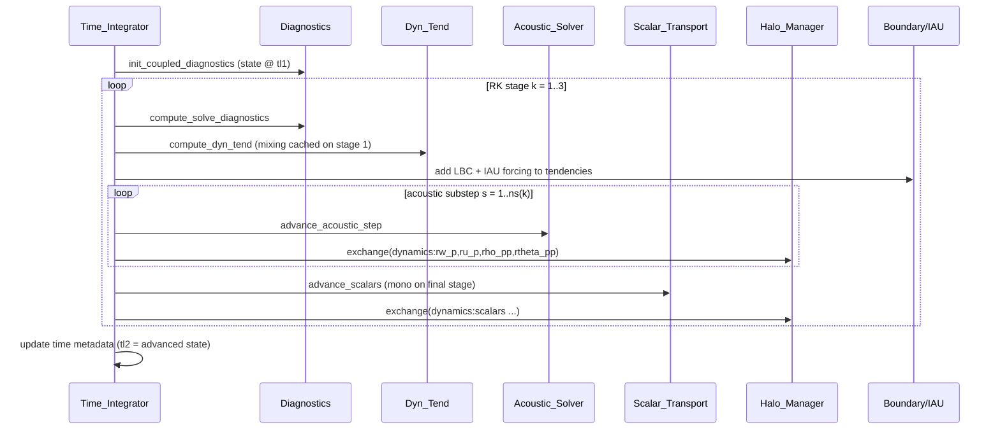
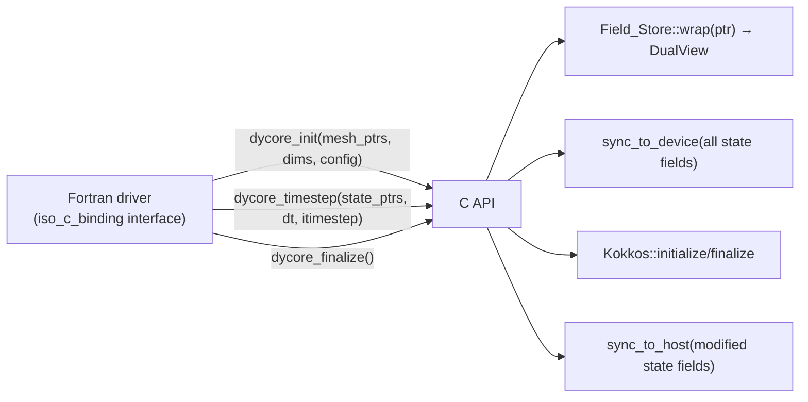

# Design Document

## Overview

The Dycore_Port re-implements the MPAS-Atmosphere nonhydrostatic dynamical core in C++ using
Kokkos for performance-portable parallelism and KokkosKernels for linear algebra and graph
coloring. It replaces the Fortran routines in `mpas_atm_time_integration.F`,
`mpas_atm_dissipation_models.F`, `mpas_atm_boundaries.F`, `mpas_atm_iau.F`, and
`mpas_atm_halos.F`, together with their OpenACC-directive acceleration, with a single Kokkos
source base that runs on both host/CPU and device/GPU Execution_Spaces.

The design has two overriding constraints that shape every decision:

1. **Numerical parity, not rewrite.** The port must reproduce the Reference_Model (the existing
   Fortran dycore) to within a single unified Parity_Tolerance on both CPU and GPU
   (Requirement 12). This means the C++ kernels replicate the *same* arithmetic operations,
   ordering, and coefficient tables as the Fortran, rather than re-deriving the numerics. Where
   parallel reductions or unstructured accumulations could reorder floating-point arithmetic, the
   design fixes the order (via Graph_Coloring) so results stay within tolerance and are
   reproducible (Requirement 2.6, Requirement 12).

2. **Hybrid-ownership interoperability.** The port lives inside the existing MPAS-Atmosphere build and
   is driven by the existing atmosphere core driver (Requirement 13). Prognostic state fields and
   mesh geometry owned by the Fortran driver are wrapped as Kokkos DualViews whose host mirror IS
   the Fortran pointer (zero-copy on host) with a Kokkos-allocated device copy; `sync_to_device()`
   at timestep entry and `sync_to_host()` at timestep exit keep the two sides coherent
   (Requirement 1.9, 1.11, 1.12). Dycore-internal fields (tendencies, acoustic temporaries,
   scratch buffers) are fully C++-owned Views allocated in the device memory space and never
   exposed to Fortran (Requirement 1.10). Physics and I/O continue to operate on host-side Fortran
   pools unchanged (Requirement 13.9).

### Research Notes and Key Findings

The following findings from the Reference_Model sources and the Kokkos ecosystem inform the
design. They are summarized here because they drive concrete design choices.

- **Fortran storage order.** MPAS Fortran fields are declared `field(nVertLevels, nCells)` (and
  similar), i.e. the vertical/inner index varies fastest. `Kokkos::LayoutLeft` (column-major)
  makes the leftmost index vary fastest, matching this exactly, so wrapping a Fortran pointer as
  the host mirror of a DualView with LayoutLeft indexes identically to the Fortran array. This is
  the basis for Requirement 1.8 and 1.9. The device side of the DualView is also LayoutLeft,
  which is coalescing-friendly when the leftmost (vertical) index maps to the fastest-varying
  thread stride only if we choose the parallelization axis carefully (see Execution Strategy).

- **Sequential vertical dependency.** The acoustic solver and vertical mixing solve tridiagonal
  systems down a column. This recurrence cannot be parallelized across levels. The design keeps
  the column loop sequential *inside* a kernel and parallelizes across horizontal elements
  (cells/edges), which is exactly how the Fortran+OpenACC version is structured
  (Requirement 2.2).

- **Unstructured accumulation hazards.** Edge-to-cell flux gathers write to a cell from several
  edges; naive parallel-over-edges would race. KokkosKernels `KokkosGraph::graph_color` produces
  a coloring of the edge (or edge-neighbor) graph such that edges of one color never share a
  target cell. Iterating color-by-color removes the race without atomics and fixes the
  accumulation order, which supports both correctness and reproducibility
  (Requirement 2.6, Requirement 12). The alternative (thread-team local duplication then a
  team reduction) is used where a coloring is not natural.

- **Halo library.** `helm-project/libs/halo` (the Halo_Library) provides a C++, GPU-aware,
  RAII halo-exchange API. It exchanges a registered set of buffers between MPI ranks and can
  operate directly on device pointers when GPU-aware MPI is present, otherwise staging through
  host. The Halo_Manager wraps it and preserves the named Halo_Group composition of the Fortran
  `mpas_atm_halos.F` (Requirement 11).

- **KokkosKernels availability.** Batched dense solves (`KokkosBatched`) and BLAS-1/2 operations
  are used where the Reference_Model performs standard linear algebra; the tridiagonal sweeps are
  kept as explicit Thomas-algorithm kernels because they carry the Reference_Model's exact
  coefficient handling and Rayleigh-damping coupling (Requirement 2.3).

## Architecture

The Dycore_Port sits between the MPAS Fortran driver/data structures and the Kokkos/KokkosKernels
runtime. The Fortran core calls three C-ABI entry points (initialize, timestep, finalize); the
C++ side wraps Fortran-owned memory in Field_Store, runs Kokkos kernels, and calls the
Halo_Manager for communication.



### Control flow of one timestep

`Time_Integrator` orchestrates the SRK3 sweep. Each RK stage computes diagnostics and tendencies,
subcycles the acoustic solver, transports scalars, applies boundary/IAU forcing, and exchanges
halos between substeps, mirroring `atm_srk3`.



### Layered structure

- **Interop layer** (`dycore_c_api.cpp`, Fortran `iso_c_binding` shims): translates the three
  driver entry points and passes raw pointers + dimensions (Requirement 13.1, 13.2). Owns the
  Kokkos `initialize`/`finalize` lifecycle (Requirement 13.5). Calls `sync_to_device` on all
  DualView-wrapped state fields at timestep entry and `sync_to_host` on modified state fields at
  timestep exit (Requirement 13.7, 13.8).
- **Storage layer** (`Field_Store`): wraps Fortran memory as DualViews (host mirror = Fortran
  pointer, device = Kokkos-allocated copy), allocates dycore-internal scratch/owned Views with
  RAII, provides `sync_to_device`/`sync_to_host` operations (Requirement 1).
- **Compute layer** (the eight numerical modules): pure-ish kernels parameterized over
  `ExecutionSpace` (Requirement 2). Internal temporaries use owned Views from `allocate()`.
- **Communication layer** (`Halo_Manager`): named-group halo exchange over Halo_Library
  (Requirement 11).
- **Verification layer** (`Component_Test_Suite`): unit + property-based tests, built and run in
  the Dev_Container (Requirement 14).

## Components and Interfaces

All compute components are templated on `ExecSpace` (a Kokkos execution space) and operate on
`Field_Store` handles plus a `MeshData` connectivity/geometry struct and a `Config` struct.
Interfaces below use representative signatures; extents follow the Reference_Model.

### Field_Store

Responsibility: own and expose field storage with hybrid ownership (Requirement 1).

The Field_Store implements a **hybrid memory ownership model**:
- **Dycore-internal fields** (intermediate tendencies, acoustic substep temporaries, scratch
  buffers, dissipation working arrays) are C++-owned Kokkos Views allocated via `allocate()` in
  the active Execution_Space's memory space, RAII-managed, and never exposed to Fortran.
- **Prognostic state fields** (theta_m, rho_zz, u, w, scalars, density) and **mesh geometry**
  are Fortran-allocated and wrapped via `wrap()` as Kokkos DualViews. The host mirror IS the
  Fortran pointer (zero-copy on host); the device side is a Kokkos-allocated copy.
- Explicit `sync_to_device(field)` / `sync_to_host(field)` deep-copy between sides.

```cpp
template <class Scalar, class ExecSpace>
class Field_Store {
public:
  using memory_space = typename ExecSpace::memory_space;
  using host_space   = Kokkos::HostSpace;
  using view2d       = Kokkos::View<Scalar**, Kokkos::LayoutLeft, memory_space>;        // owned (device)
  using dualview2d   = Kokkos::DualView<Scalar**, Kokkos::LayoutLeft, ExecSpace>;       // wraps Fortran

  // Allocate a C++-owned View in the active memory space (RAII: dtor frees) — Req 1.10, 1.3, 1.4
  view2d allocate(const std::string& name, int n_inner, int n_elem);

  // Wrap Fortran-owned memory as a DualView (host mirror = Fortran ptr, device = Kokkos copy)
  // The host side IS the Fortran pointer (zero-copy on host) — Req 1.9
  dualview2d wrap(Scalar* fortran_ptr, int n_inner, int n_elem);

  // Sync host→device: deep-copy host mirror to device copy — Req 1.11
  void sync_to_device(const std::string& field);

  // Sync device→host: deep-copy device copy back to host mirror (Fortran pointer) — Req 1.12
  void sync_to_host(const std::string& field);

  // Access a specific time level (works for both owned and wrapped fields) — Req 1.2, 1.13
  view2d level(const std::string& name, int time_level);

  // Query preserved dims/extents — Req 1.5
  Extents extents(const std::string& name) const;
};
```

- LayoutLeft is fixed for all multidimensional Views and DualViews (Requirement 1.8).
- `Scalar` is bound to `RKIND` (double or single) at build time (Requirement 1.6).
- Views are passed by value into kernels; their accessors are usable inside `parallel_for`
  (Requirement 1.7). Owned Views free storage in their destructor; DualView-wrapped fields
  release only the device copy (the host side/Fortran pointer is not freed) (Requirement 1.4, 1.9).
- `sync_to_device` / `sync_to_host` use `Kokkos::deep_copy` between the host mirror and device
  View of a DualView. These are called by the C API boundary layer, not by compute kernels.

### Time_Integrator (Requirement 3)

Responsibility: SRK3 orchestration equivalent to `atm_timestep`/`atm_srk3`.

```cpp
class Time_Integrator {
public:
  void advance(Domain& dom, double dt, Time now, int itimestep);   // Req 3.1, 3.8
private:
  void rk_stage(Domain&, int stage, double stage_dt);              // Req 3.2, 3.3, 3.4
  int  acoustic_substeps(int stage) const;                          // Req 3.6
  void validate_scheme(const Config&) const;                        // Req 3.7
};
```

- Reads RK stage weights and per-stage acoustic substep counts from Reference_Model tables
  (Requirement 3.2, 3.3, 3.4, 3.6). Subcycles dry dynamics when dynamics-transport splitting is
  enabled (Requirement 3.5). Rejects any scheme other than SRK3 with an error naming the scheme
  (Requirement 3.7). Advances Time_Level 1 to Time_Level 2 and updates model time metadata on
  completion (Requirement 3.1, 3.8).

### Acoustic_Solver (Requirement 4)

Responsibility: forward-backward vertically implicit acoustic substep (`atm_advance_acoustic_step`).

```cpp
class Acoustic_Solver {
public:
  void advance_acoustic_step(Domain&, int stage, int substep, double dts);
};
```

- Updates perturbation horizontal momentum, vertical momentum, density, and coupled potential
  temperature (Requirement 4.1); accumulates time-averaged horizontal and vertical mass fluxes
  across substeps (Requirement 4.2). Runs the tridiagonal vertical sweep (Thomas algorithm) with
  precomputed implicit coefficients, keeping the sequential vertical dependency inside the kernel
  (Requirement 4.3, Requirement 2.2). Zeroes accumulated fields when `substep == 1`
  (Requirement 4.4). Applies implicit Rayleigh damping in the absorbing layer (Requirement 4.5),
  the regional specified-zone update path where applicable (Requirement 4.6), and 3-D divergence
  damping to horizontal momentum after each substep (Requirement 4.7).

### Scalar_Transport (Requirement 5)

Responsibility: standard and monotonic scalar advection (`atm_advance_scalars` /
`atm_advance_scalars_mono`).

```cpp
class Scalar_Transport {
public:
  void advance_scalars(Domain&, int stage, bool final_stage);
};
```

- Uses standard (non-limited) transport on non-final RK substeps and the monotonic/positive-
  definite limiter on the final substep when enabled (Requirement 5.1, 5.2). Horizontal fluxes use
  the third-order upwind-biased scheme with the configured coefficient; vertical fluxes use the
  Reference_Model flux operator (Requirement 5.3, 5.4). Re-integrates density over the transport
  timestep when transport is split (Requirement 5.5). The limiter keeps each scalar within local
  min/max bounds within Parity_Tolerance on CPU and GPU (Requirement 5.6); negative water-species
  mixing ratios are set to zero after update (Requirement 5.7). Applies regional boundary flux
  treatment in relaxation/specified zones (Requirement 5.8). Edge-to-cell flux accumulation uses
  Graph_Coloring (Requirement 2.6).

### Dyn_Tend_Module (Requirement 6)

Responsibility: coupled tendencies for u, w, theta_m, rho (`atm_compute_dyn_tend`).

```cpp
class Dyn_Tend_Module {
public:
  void compute_dyn_tend(Domain&, int stage, Dissipation_Module&);
};
```

- Computes coupled tendencies for horizontal momentum, vertical momentum, coupled potential
  temperature, and density (Requirement 6.1); mass-flux divergence from mesh
  connectivity/geometry (Requirement 6.2); nonlinear Coriolis via the vector-invariant form
  (Requirement 6.3); spherical curvature terms when enabled (Requirement 6.4). Computes horizontal
  and vertical mixing on stage 1 and caches it for reuse (Requirement 6.5). Applies u Rayleigh
  damping over configured levels when enabled (Requirement 6.6) and adds physics tendencies for u,
  theta_m, and rho (Requirement 6.7).

### Diagnostics_Module (Requirement 7)

Responsibility: solve and coupled diagnostics (`atm_compute_solve_diagnostics`,
`atm_init_coupled_diagnostics`).

```cpp
class Diagnostics_Module {
public:
  void compute_solve_diagnostics(Domain&);   // Req 7.1, 7.2, 7.3
  void init_coupled_diagnostics(Domain&);     // Req 7.4
};
```

- Computes edge density, tangential velocity, relative vorticity, divergence, kinetic energy, and
  edge potential vorticity (Requirement 7.1); applies APVM upstream bias when configured with a
  positive coefficient (Requirement 7.2) and the Hollingsworth KE adjustment when enabled
  (Requirement 7.3). Derives coupled theta, density, mass fluxes, Exner, and pressure for coupled
  diagnostics (Requirement 7.4).

### Dissipation_Module (Requirement 8)

Responsibility: mixing/dissipation and LES models (`mpas_atm_dissipation_models.F`).

```cpp
class Dissipation_Module {
public:
  void compute_eddy_viscosity(Domain&);                 // Req 8.1-8.6
  void apply_hyperdiffusion(Domain&);                   // Req 8.7
  void apply_vertical_mixing(Domain&);                  // Req 8.8, 8.9
  static int les_model_from_string(std::string_view);   // Req 8.10
  static int les_surface_from_string(std::string_view); // Req 8.11
};
```

- 2-D Smagorinsky or fixed horizontal eddy viscosity (Requirement 8.1, 8.2); 3-D Smagorinsky and
  prognostic 1.5-order TKE LES models with the TKE tendency (Requirement 8.3, 8.4); moist
  Brunt-Väisälä frequency selecting dry/moist formulation by cloud-water threshold
  (Requirement 8.5); eddy-viscosity stability bounding (Requirement 8.6). Fourth-order
  hyperdiffusion on u, w, theta, and scalars (Requirement 8.7); second-order vertical filter in
  height space on full or perturbation state (Requirement 8.8); LES surface flux lower boundary
  condition (Requirement 8.9). String-to-option conversions return the Reference_Model
  invalid-option value on unrecognized input (Requirement 8.10, 8.11).

### Boundary_Module (Requirement 9)

Responsibility: limited-area LBC management (`mpas_atm_boundaries.F`).

```cpp
class Boundary_Module {
public:
  void update_boundary_tendency(Domain&, Time now);           // Req 9.1, 9.2
  View getTendency(const std::string& field, double d_time);   // Req 9.3
  View getState(const std::string& field, double d_time);      // Req 9.4
  void setup_boundary_masks(Domain&);                          // Req 9.6
  void validate_regional_config(const Config&) const;          // Req 9.8-9.10
};
```

- First update reads the latest boundary data on/before current time into Time_Level 2; later
  updates shift TL2 to TL1, read the earliest data strictly after current time, and difference
  over the boundary interval (Requirement 9.1, 9.2). Returns tendency arrays and extrapolated
  states for named fields at a future delta-time (Requirement 9.3, 9.4). Derives coupled density,
  edge density, coupled moist theta, and mass flux from boundary fields (Requirement 9.5). Sets up
  specified-zone masks and nearest relaxation cell (Requirement 9.6); applies Rayleigh relaxation
  and horizontal-filter adjustments in the relaxation zone (Requirement 9.7). Reports
  configuration errors for the three misconfiguration cases (Requirement 9.8, 9.9, 9.10).

### IAU_Module (Requirement 10)

Responsibility: Incremental Analysis Update forcing (`mpas_atm_iau.F`).

```cpp
class IAU_Module {
public:
  void add_iau_tendency(Domain&, int itimestep);   // Req 10.1-10.4
};
```

- No forcing when IAU is off (Requirement 10.1); within the IAU window with IAU on, adds forcing
  to momentum, density, coupled theta, and moisture tendencies using the constant IAU weight
  (Requirement 10.2); returns without modification when the weight is at or below the negligible
  threshold (Requirement 10.3); converts the theta increment to a coupled moist theta tendency
  (Requirement 10.4).

### Halo_Manager (Requirement 11)

Responsibility: named halo-group exchange over Halo_Library with RAII.

```cpp
class Halo_Manager {
public:
  explicit Halo_Manager(Domain&, const Config&);   // creates all groups — Req 11.1, 11.2, 11.8, 11.9
  ~Halo_Manager();                                  // releases buffers/groups — Req 11.7
  void exchange(const std::string& group_name);     // Req 11.3, 11.4, 11.5, 11.6
  void validate_method(const Config&) const;        // Req 11.10
};
```

- Constructor creates every initialization/dynamics/physics Halo_Group with the exact field
  membership, Time_Level, and Halo_Layer composition of the Reference_Model, including all named
  groups listed in Requirement 11.8 and the physics groups `physics:blten`/`physics:cuten` when
  the physics build option is enabled (Requirement 11.1, 11.2, 11.8, 11.9). `exchange` updates the
  halo regions of every field in a group via the Halo_Library (Requirement 11.3, 11.4). With
  GPU-aware communication enabled it exchanges device-resident data with no host copy; otherwise it
  stages between device and host around the exchange (Requirement 11.5, 11.6). The destructor
  releases owned communication buffers and group resources (Requirement 11.7). An unrecognized
  exchange method is reported as a configuration error naming the method (Requirement 11.10).

## C++/Fortran Interoperability Boundary

The port is invoked through a thin C ABI so the existing Fortran driver can call it without
knowledge of Kokkos (Requirement 13.1).



- Three entry points map to the Reference_Model dynamics-initialize, timestep-advance, and
  dynamics-finalize hooks (Requirement 13.1). Mesh geometry, connectivity, dimensions, and config
  values are passed as raw pointers/scalars sourced from existing MPAS pools; no MPAS data
  structure is reallocated (Requirement 13.2).
- All prognostic state/geometry pointers are wrapped via `Field_Store::wrap()` as DualViews.
  The host mirror IS the Fortran pointer (zero-copy on host); the device side is a
  Kokkos-allocated copy (Requirement 1.9).
- **Timestep entry:** `dycore_timestep` calls `sync_to_device()` on all DualView-wrapped state
  fields before any kernel executes, ensuring the device sees the latest host data written by
  Fortran physics/I/O (Requirement 13.7).
- **Timestep exit:** `dycore_timestep` calls `sync_to_host()` on all modified prognostic state
  fields before returning to Fortran, so that physics and I/O operate on valid host data
  (Requirement 13.8).
- **Physics/I/O unchanged:** Fortran physics and I/O subsystems continue to access state through
  their existing host-side pool pointers with no modification required (Requirement 13.9).
- `dycore_init` calls `Kokkos::initialize` (once) before any kernel; `dycore_finalize` calls
  `Kokkos::finalize` during model shutdown (Requirement 13.5).
- Per-build fixed inner dimensions (nVertLevels, maxEdges, num_scalars) are passed once and used
  as compile-time-friendly extents consistent with the Reference_Model (Requirement 13.4).
- Dycore-internal fields (tendencies, acoustic temporaries, scratch) are allocated as C++-owned
  Views via `Field_Store::allocate()` and are never visible to Fortran (Requirement 1.10).

## Data Models

### MeshData (connectivity and geometry)

Read-only DualView-wrapped Views over MPAS pool arrays; the host mirror IS the Fortran pointer,
the device side is synced once during `dycore_init` and remains static thereafter. Consumed by
every compute module (Requirement 13.2). Representative members:

| Field | Shape (LayoutLeft) | Meaning |
|-------|--------------------|---------|
| `cellsOnEdge` | `(2, nEdges)` | cell neighbors of each edge |
| `edgesOnCell` | `(maxEdges, nCells)` | edges around each cell |
| `verticesOnEdge` | `(2, nEdges)` | vertices bounding each edge |
| `nEdgesOnCell` | `(nCells)` | valid edge count per cell |
| `dvEdge`, `dcEdge`, `areaCell` | `(nEdges)/(nCells)` | mesh metrics |
| `zgrid`, `zz`, `fzm`, `fzp` | `(nVertLevels[+1], nCells)` | vertical geometry/weights |

### State fields (prognostic and diagnostic)

DualView-wrapped (Fortran-originated) or C++-owned LayoutLeft Views with the Reference_Model
dimension order (vertical-by-horizontal) and RKIND precision (Requirement 1.5, 1.6). Time-leveled
fields expose Time_Level 1 and 2 (Requirement 1.2). The `sync_to_device` / `sync_to_host`
boundary applies only to DualView-wrapped fields.

| Field | Shape | Time levels | Storage type |
|-------|-------|-------------|--------------|
| `u` (horizontal momentum) | `(nVertLevels, nEdges)` | 2 | DualView (Fortran-owned host, Kokkos device copy) |
| `w` (vertical velocity) | `(nVertLevels+1, nCells)` | 2 | DualView (Fortran-owned host, Kokkos device copy) |
| `theta_m` (coupled theta) | `(nVertLevels, nCells)` | 2 | DualView (Fortran-owned host, Kokkos device copy) |
| `rho_zz` (dry density) | `(nVertLevels, nCells)` | 2 | DualView (Fortran-owned host, Kokkos device copy) |
| `scalars` | `(num_scalars, nVertLevels, nCells)` | 2 | DualView (Fortran-owned host, Kokkos device copy) |
| `ru_p`, `rw_p`, `rho_pp`, `rtheta_pp` | perturbation acoustic fields | 1 | C++-owned View (device, `allocate()`) |
| `ruAvg`, `wwAvg` | accumulated mass fluxes | 1 | C++-owned View (device, `allocate()`) |
| tendency intermediates (Dyn_Tend) | various | 1 | C++-owned View (device, `allocate()`) |
| acoustic temporaries (tridiag coeffs, etc.) | various | 1 | C++-owned View (device, `allocate()`) |
| dissipation working arrays | various | 1 | C++-owned View (device, `allocate()`) |

### Config

Immutable snapshot of namelist options consumed by the modules: `time_integration_order`,
`number_of_sub_steps`, `dynamics_split_steps`, `config_monotonic`, `config_scalar_advection`,
`config_apply_lbcs` (Regional_Mode), `config_mix_full`, LES model/surface option strings,
`config_iau`, GPU-aware-comm flag, and halo exchange method. Validated at construction
(Requirement 3.7, 8.10, 8.11, 9.8-9.10, 11.10).

### Halo_Group registry

A table mapping group name to an ordered list of `(field, time_level, {halo_layers})` tuples,
initialized from the Reference_Model composition and consumed by the Halo_Manager
(Requirement 11.2, 11.8).

## Kokkos Execution and Memory Strategy

This section consolidates the portability decisions (Requirement 2).

### Parallelization pattern

- **Parallelize over horizontal elements, loop sequentially over vertical levels.** Every ported
  loop becomes a Kokkos parallel construct on the active Execution_Space (Requirement 2.1). For
  columnar solves with vertical recurrences (acoustic tridiagonal sweep, vertical mixing), the
  outer `parallel_for` ranges over cells/edges and each thread walks levels sequentially,
  preserving the vertical dependency (Requirement 2.2). `Kokkos::TeamPolicy` is used where a
  column needs shared scratch (tridiagonal coefficient buffers).
- **No OpenACC.** All acceleration is expressed through Kokkos; the OpenACC directives of the
  Reference_Model are dropped (Requirement 2.5).

### Avoiding races in unstructured accumulations

- Edge-to-cell flux gathers and similar scatter/gather over unstructured connectivity use
  **Graph_Coloring** from KokkosKernels `KokkosGraph::graph_color`. Edges are colored so that no
  two edges of the same color write the same cell; the port iterates color sets sequentially and
  parallelizes within a color. This removes races without atomics and, because the per-cell
  accumulation order is fixed by the coloring, keeps floating-point results reproducible and within
  Parity_Tolerance (Requirement 2.6, Requirement 12). Where a natural coloring is unavailable,
  thread-team local duplication with a subsequent team reduction is used (Requirement 2.6).

### KokkosKernels usage

- Standard linear algebra (batched dense operations, BLAS-1/2 reductions) uses KokkosKernels
  (Requirement 2.3). The tridiagonal sweeps are kept as explicit Thomas-algorithm kernels to carry
  the Reference_Model's exact implicit coefficients and Rayleigh-damping coupling
  (Requirement 4.3, 4.5).

### Memory spaces and layout

- Field_Store uses a hybrid ownership model: `allocate()` creates C++-owned Views in the active
  `ExecSpace::memory_space` (device for GPU, host for CPU-only); `wrap()` creates DualViews whose
  host mirror is the Fortran pointer and whose device side is a Kokkos-allocated copy
  (Requirement 1.1, 1.9, 1.10). LayoutLeft is enforced for interop and coalescing
  (Requirement 1.8).
- `sync_to_device()` deep-copies host→device; `sync_to_host()` deep-copies device→host. These
  are invoked by the C API boundary layer at timestep entry/exit respectively (Requirement 1.11,
  1.12, 13.7, 13.8).
- Mesh geometry is synced to device once during `dycore_init` and treated as static thereafter.
- Halo exchange operates on device-resident buffers directly when GPU-aware comm is enabled, else
  stages through host (Requirement 11.5, 11.6).

### Parity and determinism strategy (Requirement 12)

- A single unified `Parity_Tolerance` is applied on both CPU and GPU. It is a tight relative
  tolerance near machine epsilon with documented ceilings of `1e-12` (double) and `1e-6` (single)
  that a compared field must not exceed (Requirement 12.1, 12.2). Host-vs-device bit-for-bit
  equality is explicitly not required (Requirement 2.4).
- Determinism supporting parity comes from fixing accumulation order via Graph_Coloring rather than
  atomics, so repeated runs on the same Execution_Space and comparisons across spaces stay within
  tolerance (Requirement 2.6). Bit_Reproducibility is treated as an optional diagnostic only.
- Total dry air mass is conserved over a timestep within Parity_Tolerance on both spaces
  (Requirement 12.3); global min/max diagnostics for w and u are reported consistently with the
  Reference_Model within tolerance (Requirement 12.4). Any compared prognostic field containing a
  NaN triggers a critical error naming the field (Requirement 12.5). Parity comparisons run inside
  the Dev_Container for reproducibility, driven by pinned idealized test cases on standardized MPAS
  meshes (Requirement 12.6); see the Testing Strategy for fixture provenance.

## Correctness Properties

*A property is a characteristic or behavior that should hold true across all valid executions of a
system-essentially, a formal statement about what the system should do. Properties serve as the
bridge between human-readable specifications and machine-verifiable correctness guarantees.*

The properties below were derived from the acceptance-criteria prework and consolidated to remove
redundancy (for example the tridiagonal-solve criteria 2.2 and 4.3 were merged, and the several
CPU/GPU/reference agreement criteria were consolidated into a single component-parity property).
Each property is universally quantified and drives a Property_Based_Test (Requirement 14.3).

### Property 1: Field_Store preserves extents and column-major layout

*For any* set of field extents `(n_inner, n_elem)`, a Field_Store allocation SHALL produce a View
whose reported extents equal the requested extents and whose element at logical index `(i, j)`
occupies linear memory offset `i + n_inner * j` (LayoutLeft, leftmost index fastest).

**Validates: Requirements 1.5, 1.8**

### Property 2: DualView zero-copy host aliasing and device sync round-trip

*For any* buffer of Fortran-owned memory and any sequence of writes to the host side, wrapping
the buffer via `Field_Store::wrap()` SHALL make the host mirror alias the original Fortran
pointer (zero-copy on host: mutations through the host mirror are observable through the original
raw pointer). Additionally, a `sync_to_device` followed by `sync_to_host` round-trip SHALL
reproduce the host data on the device and back to within Parity_Tolerance. Destroying the
DualView SHALL leave the underlying Fortran buffer allocated and valid (only the device copy is
freed).

**Validates: Requirements 1.9, 1.4, 1.11, 1.12**

### Property 3: Tridiagonal solve satisfies its system

*For any* diagonally dominant tridiagonal system `A` and right-hand side `b`, the ported vertical
tridiagonal sweep SHALL produce a solution `x` such that `A*x` equals `b` to within the
Parity_Tolerance, preserving the sequential vertical dependency.

**Validates: Requirements 2.2, 4.3**

### Property 4: Monotonic limiter keeps scalars within local bounds

*For any* scalar field and mesh, after monotonic/positive-definite transport on the final
Runge-Kutta substep, every updated cell value SHALL lie within the local minimum and maximum of the
values contributing to that cell, to within the Parity_Tolerance on both the host/CPU and
device/GPU Execution_Space.

**Validates: Requirements 5.6**

### Property 5: Positive-definite transport keeps water species non-negative

*For any* input scalar state (including states with values that would otherwise drive a mixing
ratio negative), after a scalar update every water-species mixing ratio SHALL be greater than or
equal to zero.

**Validates: Requirements 5.7**

### Property 6: Conservation of total dry air mass

*For any* valid initial state, advancing the state by one timestep SHALL leave the total dry air
mass equal to its initial value to within the Parity_Tolerance on both the host/CPU and device/GPU
Execution_Space, matching the Reference_Model conservation behavior.

**Validates: Requirements 12.3**

### Property 7: Component parity with the reference model across execution spaces

*For any* valid input state to a ported component, executing that component on the host/CPU
Execution_Space and on the device/GPU Execution_Space SHALL each produce output that matches the
Reference_Model output for the same input to within the Parity_Tolerance, without requiring
host-versus-device bit-for-bit equality.

**Validates: Requirements 2.4, 12.1, 12.2**

### Property 8: Deterministic unstructured accumulation

*For any* mesh and edge-flux input, repeated executions of an unstructured flux/edge-to-cell
accumulation kernel SHALL produce identical results, because the accumulation order is fixed by
Graph_Coloring (or team-local duplication) rather than atomics.

**Validates: Requirements 2.6**

### Property 9: Eddy-viscosity stability bound

*For any* deformation and state input, each eddy viscosity computed by the Dissipation_Module SHALL
not exceed the stability limit defined by the Reference_Model.

**Validates: Requirements 8.6**

## Error Handling

Errors are surfaced through a single `DycoreStatus` return/exception path that propagates a
diagnostic code and message back across the C ABI to the Fortran driver, so the model can abort or
report cleanly.

| Condition | Detection point | Handling | Requirement |
|-----------|-----------------|----------|-------------|
| Unsupported time-integration scheme (not SRK3) | `Time_Integrator::validate_scheme` at init | Report error naming the scheme; abort init | 3.7 |
| Unrecognized LES model / surface option string | `Dissipation_Module::les_*_from_string` | Return the Reference_Model invalid-option value (no crash) | 8.10, 8.11 |
| Regional mode active but no boundary cells | `Boundary_Module::validate_regional_config` | Report configuration error | 9.8 |
| Regional mode inactive but boundary cells present | `Boundary_Module::validate_regional_config` | Report configuration error | 9.9 |
| Regional mode active but no valid boundary input interval | `Boundary_Module::validate_regional_config` | Report configuration error | 9.10 |
| Unrecognized halo exchange method | `Halo_Manager::validate_method` at init | Report configuration error naming the method | 11.10 |
| NaN in a compared prognostic field | Post-timestep parity/validation check | Report critical error identifying the field; abort | 12.5 |

Additional handling principles:

- **Fail fast at configuration boundaries.** All config validations run during `dycore_init` /
  Halo_Manager construction so misconfiguration is caught before any kernel executes.
- **RAII cleanup on error.** Because Field_Store and Halo_Manager own their resources via RAII,
  an exception unwinding through the C++ layer releases owned Views and communication buffers
  before control returns to Fortran (Requirement 1.4, 11.7).
- **NaN guard.** The parity/validation pass scans compared fields for NaN and names the offending
  field, distinguishing a numerical blow-up from a mere tolerance miss (Requirement 12.5).

## Testing Strategy

The Component_Test_Suite pairs unit tests (specific behavior vs the Reference_Model) with
property-based tests (universal invariants), and is delivered incrementally: each component ships
with its tests (Requirement 14.1, 14.2). The whole suite builds and runs on the host/CPU, on the
device/GPU where available, and inside the Dev_Container (Requirements 14.7, 14.8, 14.11, 12.6,
13.6).

### Dual approach

- **Unit tests** cover concrete behaviors and error conditions: RK stage-weight and acoustic
  substep tables (3.2-3.6), diagnostics and tendency numerics vs reference (6.x, 7.x), dissipation
  numerics and option-string mappings (8.1-8.5, 8.7-8.11), boundary read/shift/extrapolate/mask
  and its three config errors (9.x), IAU gating and coupling (10.x), halo group composition and
  the method error (11.1, 11.2, 11.8, 11.9, 11.10), global min/max diagnostics (12.4), the NaN
  guard (12.5), and the scheme error (3.7). Each numeric unit test compares component output to the
  Reference_Model for the same inputs within Parity_Tolerance and, on divergence, fails identifying
  the diverging field (Requirement 14.2, 14.9).
- **Integration tests** cover the halo exchange over a small multi-rank partition, asserting halo
  cells receive owner values, and the GPU-aware vs staged transfer paths (Requirement 11.3-11.6).
  These use 1-3 representative partitions rather than property generation because they validate MPI
  wiring, not input-varying numerics.
- **Property-based tests** implement the nine Correctness_Properties above (Requirement 14.3).

### External test resources

Two external resources anchor the parity fixtures and the regression structure:

- **MPAS-Atmosphere download page** —
  <https://mpas-dev.github.io/atmosphere/atmosphere_download.html>. Source of standardized
  quasi-uniform SCVT meshes (e.g. 480 km, 240 km, 120 km resolutions) and ready-made initial
  conditions / static data for the idealized and real-data test cases. These are the canonical
  inputs for capturing Reference_Model snapshots and driving the end-to-end parity run.
- **NCAR MPAS-Model-CI** — <https://github.com/NCAR/MPAS-Model-CI>. The continuous-integration /
  regression harness for MPAS, used here as a *reference/model* for how to structure the automated
  parity regression (build configuration, pinned test cases, diffing outputs against known-good
  baselines). It is a design model for the regression approach, not necessarily a hard dependency.

### Reference data

Numeric unit and parity tests compare against Reference_Model output captured from the existing
Fortran dycore for identical inputs, generated and compared inside the Dev_Container so results are
reproducible (Requirement 12.6, 14.11).

**Canonical parity fixtures.** The parity fixtures use the standardized MPAS meshes from the
download page together with the idealized dynamical-core test cases — notably the
Jablonowski-Williamson baroclinic wave and the mountain / gravity-wave cases — as the canonical
inputs for both (a) capturing per-component Fortran Reference_Model snapshots and (b) the
end-to-end single-timestep parity comparison (Requirement 12). Idealized cases are preferred for
parity work because they are deterministic (analytic or fixed initial conditions, no data
assimilation or stochastic forcing) and exercise the dycore code paths without pulling in the full
physics suite, which isolates the ported numerics from unrelated model components. A coarse mesh
(e.g. 480 km or 240 km) is used for per-component reference snapshots so the captured baselines stay
small and the comparison runs fast; the finer meshes remain available when a case needs more
resolution.

**Provenance and pinning.** Reference inputs (meshes, initial conditions, static files) are
obtained from the MPAS-Atmosphere download page and pinned/cached inside the Dev_Container, so the
exact same inputs drive every parity comparison and results are reproducible across machines
(Requirement 12.6, 14.11).

**Regression structure.** The parity comparison is organized as an automated regression modeled on
NCAR's MPAS-Model-CI harness: a fixed build configuration, a pinned set of idealized test cases,
and a diff of the port's outputs against the known-good Reference_Model baselines within
Parity_Tolerance. The regression builds and runs inside the Dev_Container. MPAS-Model-CI is treated
as a reference/model for this structure rather than a required dependency.

### Property-based testing plan

Because the Dycore_Port is C++, property tests use **RapidCheck** (a C++ property-based testing
library with shrinking), integrated with the suite's test runner. Property-based testing is *not*
implemented from scratch.

- Each property test runs a configurable number of generated cases, defaulting to at least **100
  iterations** (Requirement 14.5), and evaluates its property on the active Execution_Space
  (Requirement 14.4).
- On failure, RapidCheck **shrinks** the generated input to a minimal counterexample and the test
  fails identifying the violated Correctness_Property (Requirement 14.6, 14.10).
- Each property test is tagged with a comment referencing its design property, in the format:
  **Feature: mpas-dycore-cpp-port, Property {number}: {property_text}**.
- Generators produce valid domain inputs: random mesh extents and connectivity for storage/layout
  and accumulation properties; diagonally dominant tridiagonal systems for the solver property;
  random scalar fields (including near-zero and negative-driving values) for the limiter and
  non-negativity properties; random valid initial states for conservation and parity; random
  deformation/state for the eddy-viscosity bound.

Property-to-test mapping:

| Property | Generated input | Assertion |
|----------|-----------------|-----------|
| 1 Field_Store extents+layout | random `(n_inner, n_elem)` | extents match; offset `i + n_inner*j` |
| 2 Unmanaged aliasing | random buffer + writes | host writes visible via raw ptr; sync round-trip preserves data; buffer valid after dtor |
| 3 Tridiagonal solve | random diag-dominant `A`, `b` | `A*x == b` within tolerance |
| 4 Monotonic limiter bounds | random scalar field + mesh | updated value within local min/max (both spaces) |
| 5 Water-species non-negativity | random scalar state incl. negatives | all water mixing ratios `>= 0` |
| 6 Dry-mass conservation | random valid state | total dry mass preserved within tolerance (both spaces) |
| 7 Component parity | random valid component input | host & device match reference within tolerance |
| 8 Deterministic accumulation | random mesh + edge fluxes | repeated runs identical |
| 9 Eddy-viscosity bound | random deformation/state | viscosity `<=` stability limit |

### Execution environments

- **Host/CPU:** default target; the full suite runs here (Requirement 14.7).
- **Device/GPU:** when a device Execution_Space is available, the suite (including
  execution-space-parameterized property tests) runs on device (Requirement 14.8); parity tests
  compare device results to the Reference_Model within Parity_Tolerance (Requirement 12.2).
- **Dev_Container:** the suite builds and runs inside the `helm-project-helm-dev` image using its
  pinned Kokkos, KokkosKernels, and Halo_Library, so parity comparisons are reproducible
  (Requirement 14.11, 12.6, 13.6).

### Coverage note

Requirements that are structural, environmental, or meta (2.1, 2.3, 2.5 implementation structure;
1.6/1.7 type/compile checks; 12.6/14.x environment and suite-delivery constraints) are satisfied by
build configuration, static assertions, and CI wiring rather than by property tests, as determined
in the prework classification.
